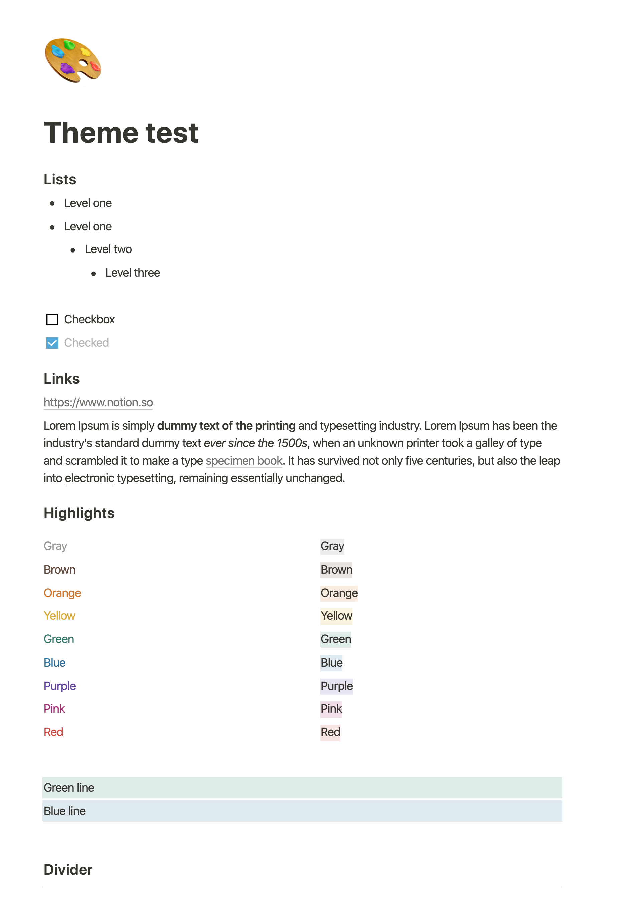
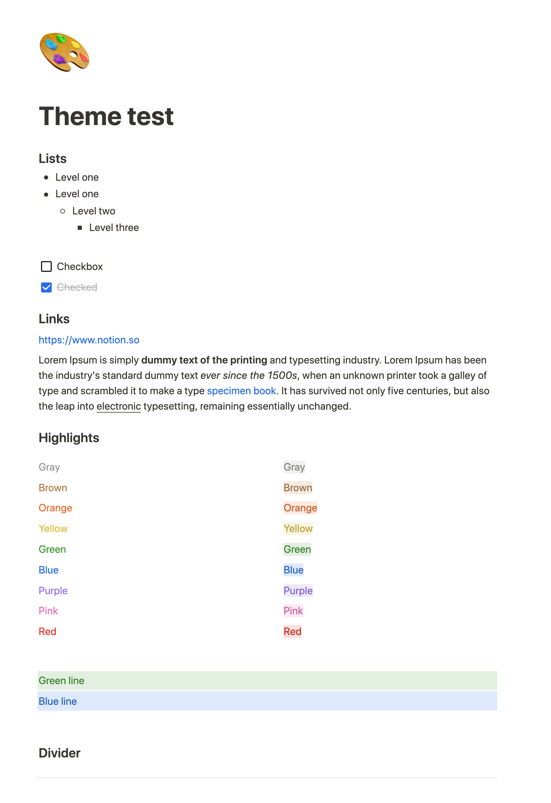

# Notion Enhancer Tweaks
Collection of tweaks and user styles for the Desktop version of [Notion](http://notion.so), loaded into [notion-enhancer](https://github.com/notion-enhancer/notion-enhancer). You don't need to run this entire project, you can just get the generated CSS file and load it into notion-enhancer.

Notable changes are
- blue links
- improved highlight colors
- tighter lists with better bullets
- rounded checkboxes
- hiding some `Add …` links
- hiding the `Type "/" for commands` prompt
- truncating long page links

Here's a before and after:

This project consists of:
- A Stylus file, and its compiled result `notion-enhancer-tweaks.css`
- A demo to quickly test the colors, with HTML written in Pug
- A Gulp pipeline to generate the files and livereload everything

## Requirements
- NPM
- Gulp

## First run
    $ npm install

## Build
    $ gulp
    
## Run from simple php server
    php -S localhost:8000   
